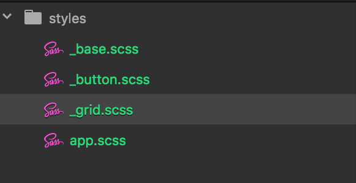

# Sassを使ってより効率的にCSSを書こう

## 目的

- Sassとは何か理解する
- Sassファイルの作成方法を学ぶ
- SassファイルをCSSファイルへとコンパイルする方法を学ぶ
- ネストやMixin、VariablesなどSassの基本を学ぶ

## 事前知識

このレッスンでは、Atom入門とコマンドライン入門のレッスンを完了していることを前提にしています。まだ学習が住んでいない場合は、2つのレッスンをまず学習して下さい。

## Sassとは

Sass(**S**yntactically **A**wesome **S**tyle**S**heets)は、簡単に言うとCSSを拡張するための言語です。Bootstrapフレームワークでも採用されていて、世界中の多くのフロントエンド開発者が利用しています。このSassを使うことでCSSをより分かりやすく、また少ないコードで書くことが出来、フロントエンド開発をするなら必ず習得して置きたいスキルです。

## NPM、Node.jsのインストール

Sassを利用するにはNode.jsとNPMというパッケージがパソコンにインストールされている必要があります。以下の流れにしたがってまずNode.jsをインストールしてください。


1. [Node.jsのダウンロードページへアクセス](https://nodejs.org/ja/download/)
2. OSに応じて、推奨版をダウンロード(WindowsならWindows Installer、MacならMacOS Installer)
3. ダウンロードしたパッケージを開き、説明にしたがって進みインストールを完了する。
4. ターミナルまたはPowerShell上でNPM及びNodeがインストールされているか確認する。

インストールされているバージョンによって結果は異なりますが、以下のように表示されれば大丈夫です。

```bash
$ node -v
v8.11.3
$ npm -v
5.6.0
```

## Sassのインストール

1. ターミナルを開く
2. ターミナルで次のコマンドを実行する

```BASH
$ npm install -g sass
/usr/local/bin/sass -> /usr/local/lib/node_modules/sass/sass.js
+ sass@1.14.3
updated 1 package in 13.908s
```

3. バージョンを確認する。

```BASH
$ sass --version
1.14.3 compiled with dart2js 2.0.0
```

これでインストールされていることが確認でき、準備が完了しました。

### 上記の方法がうまくいかない場合

上記の方法がうまくいかない場合は、以下の方法をお試し下さい。また以下の方法もうまくいかない場合は、以下のURLにある方法もお試し下さい。なお、dart-sassを利用する場合は、後ほど利用する`--watch`というオプションが現状まだ未対応のためご注意ください。

[Standalone - dart-sass](https://github.com/sass/dart-sass#standalone)

**Windowsの場合**

1. Chocolateyのインストール

Chocolateyはパッケージマネージャーといわれるソフトウェアの一つです。次のコマンドでインストールすることが出来ます。PowerShellをAdministratorとして開いている必要がありますので注意して下さい。

```bash
$ Set-ExecutionPolicy Bypass -Scope Process -Force; iex ((New-Object System.Net.WebClient).DownloadString('https://chocolatey.org/install.ps1'))
```

以下の公式ドキュメントも参考にして下さい。

[Install with PowerShell.exe](https://chocolatey.org/install#install-with-powershellexe)

2. Sassのインストール

以下のコマンドを実行してSassをインストールします。

```bash
$ choco install sass -prerelease
```

**Macの場合**

1. Homebrewのインストール

Homebrewはパッケージマネージャーといわれるソフトウェアの一つです。次のコマンドでインストールすることが出来ます。

```bash
$ /usr/bin/ruby -e "$(curl -fsSL https://raw.githubusercontent.com/Homebrew/install/master/install)"
```

2. Sassのインストール

以下のコマンドを実行してSassをインストールします。

```bash
$ brew install sass/sass/sass
```

## scss拡張子

さてSassを使ったファイルを作成するには`scss`という拡張子を利用します。なぜ`sass`ではないかというと、実はSassには元々主流だった書き方と、現在主流の書き方の2種類が存在し、この現在主流の書き方に対応するために`scss`という拡張子を利用することになっているためです。

## ルートファイルを作成する

まずはこのscss拡張子を利用してルートファイルを作ってみましょう。命名法に決まりはないのですが、今回は`app.scss`というファイルを作ってみます。

## パーシャルファイル

ここまでのレッスンでは全てのCSSを一つのCSSファイルにまとめて書いてきました。プロジェクトが小さい内はこの方法で良いのですがコードが数百行、数千行規模になってくると1つのファイルで管理するのは大変になります。今後は役割ごとにファイルを分けていきましょう。

今回は試しに以下の３つの役割に分けてファイルを作成します。

- 1. `_base.scss`: ベースとなるスタイルをまとめたファイル
- 2. `_button.scss`: ボタン用のファイル
- 3. `_grid.scss`: グリッド用のファイル

さてここでファイル名で`_`(アンダーライン)を利用しています。Sassではルートファイルとそれ以外のサブファイルを区別するためにサブファイルの最初の文字を`_`とします。この`_`のついたファイルのことをパーシャル(Partials)と呼びます。`_`を付けることでSassは自動的にそのファイルがパーシャルであると認識してくれます。

ここまででエディタ上で以下の画像のように表示されます。



## ルートファイルにパーシャルをインポートする

さて、役割ごとにファイルを分けたのはいいですがこれらのパーシャルをルートファイルでは自動で認識してはくれません。そのため、`@import`というオプションを利用してパーシャルをルートファイルにインポートします。

`app.scss`
```SCSS
@import 'base';
@import 'button';
@import 'grid';
```

これで、app.scssが全てのパーシャルを認識するように出来ました。`@import base`のように拡張子とアンダーラインの両方を省略して書く必要がありますので注意してください。

## _base.scssをアップデートする

さてまずは_base.scssをアップデートしてみましょう。

以下を試しに入力してみましょう。

```css
* {
  box-sizing: border-box;
}

body {
  font-size: 12px;
  line-height: 1.4;
  color: #ddd;
}
```

## ルートファイルをコンパイルする

準備が整ったのでHTMLファイルにスタイルを適用してみましょう。この時HTMLファイルはSassを自動的にCSSに変換してくれません。そこでSassのファイルをCSSファイルに変換する必要があります。こうして変換することをプログラミングの世界では**コンパイル**すると言います。

SassをCSSにコンパイルするにはコマンドラインで以下のコマンドを書きます。

`sass コンパイルするファイル名:出力先ファイル名`

実際にapp.scssファイルをコンパイルして、styles.cssというファイルを作ってみましょう。

```
$ ls
_base.scss _button.scss  _grid.scss app.scss
$ sass app.scss:styles.css
$ ls
_base.scss	_button.scss	_grid.scss	app.scss	styles.css	styles.css.map
```

このようにコンパイル完了後に、`styles.css`、`styles.css.map`の2つのファイルが出来ることが分かります。

styles.cssを開いてみましょう.すると下記のようになっているはずです。_base.scssでは、CSSの書き方をしているのでほぼ一緒ですね。

```css
* {
  box-sizing: border-box; }

body {
  font-size: 12px;
  line-height: 1.4;
  color: #ddd; }

/*# sourceMappingURL=styles.css.map */
```

## ルートファイルをwatchする

`sass コンパイルするファイル名:出力先ファイル名`というコマンドをSassファイルを変更する度に実行するのは大変です。そこでSassには`watch`というオプションがついています。(dart-sassの場合は現在未対応です。)

コマンドラインで以下のように入力してみて下さい。

```BASH
$ sass --watch app.scss:styles.css
>>> Sass is watching for changes. Press Ctrl-C to stop.
```

すると上記のように、「Sassが変更を見てます」という風に表示されます。これでSassファイルを変更する度に自動的にコンパイルが起こるようになりました。

## variablesを使う

さて、ここまではCSSと全く同じ書き方をしてきたわけですが、ここからはSass流の書き方を学んでいきましょう。まず最初に`variables`の使い方から学びます。variablesは例えばサイト全体での基本となる色やフォントサイズなどを指定したい場合に利用します。例えば上記の例ではbodyに`color: #ddd;`と指定しました。これをvariablesを使って書き直すと以下のようになります。


`app.scss`
```SCSS
$base-color: #ddd;

...
```

_base.scss
```SCSS
body {
  font-size: 12px;
  line-height: 1.4;
  color: $base-color; /* variablesを利用 */
}
```

このようにvariablesを設定しておけば、CSSスタイリングの様々な場面で色などを統一しやすくなります。また、「基本のフォントカラー」という意味合いを与えることが出来るので、他の開発者が見た時にスタイリングの意味が伝わりやすくなります。

## ネストを使う

オブジェクト指向CSSの項目では、インスタグラム風のカードを試しに作ってみました。この時、投稿に対するコメント欄のCSSを以下のように書いていました。

```css
.card-comments {
  margin-bottom: 4px;
}
.card-comments a {
  margin-right: .3em;
}
```

この例では、.card-commentsにネストされているセレクタのスタイルは一つだけですが、これがもっと増えるとどうでしょう。

```css
.card-comments {...}
.card-comments a {...}
.card-comments img {...}
.card-comments .user-comment {...}
.card-comments .poster-comment {...}
```

そうすると、上の例のように文字数が多く分かりづらくなります。これをSassでは次のように書き換えることが出来ます。

```SCSS
.card-comments {
  ...
  a {...}
  img {...}
  .user-comment {...}
  .poster-comment {...}
}
```

いかがでしょう。`.card-comments`を書くのが一度だけで済むのでスッキリして分かりやすくなったはずです。

## extendを使う

グリッドレイアウトの例では以下のようなCSSスタイルを定義しました。

```css
.col-1, .col-2, .col-3, .col-lg-1, .col-lg-2, .col-lg-3 {
  padding: 0 15px;
}
```
このように、`padding:0 15px;`を定義する時に全てのセレクタを書くのもいいですが`extend`を使う書き方もあります。extendを使うと一つのセレクタのスタイルを他のセレクタで`@extend セレクタ名`で利用することが出来ます。例えば上記のCSSは以下のように書き換えられます。

```SCSS
.col-padding {
  padding: 0 15px;
}

.col-1 {
  @extend .col-padding;
  ...
}
.col-2 {
  @extend .col-padding;
  ...
}
.col-3 {
  @extend .col-padding;
  ...
}
以下続く
```

これをコンパイルすると次のようになります。

```SCSS
.col-padding, .col-1, .col-2, .col-3, .col-lg-1, .col-lg-2, .col-lg-3 {
  padding: 0 15px;
}
.col-1 {...}
.col-2 {...}
以下続く
```

`extend`を使うことでカラムの一つ一つが決まった`Padding`を持つことが分かりやすくなりました。


## オペレーター(計算式)を使う

同様にグリッドレイアウトの例では、何％の割合となるのかを一つ一つ計算して入力してました。

```css
.col-1 {
  flex-basis: 33.33%;
}

.col-2 {
  flex-basis: 66.67%;
}

.col-3 {
  flex-basis: 100%;
}
```

このやり方でも良いのですが、Sassのオペレーターを使うともっと簡単にすることが出来ます。

```SCSS
.col-1 {
  flex-basis: 1 / 3 * 100%;
}

.col-2 {
  flex-basis: 2 / 3 * 100%;
}

.col-3 {
  flex-basis: 100%;
}
```

コンパイルすると以下のようになります。

```css
.col-1 {
  flex-basis: 33.3333333333%; }

.col-2 {
  flex-basis: 66.6666666667%; }

.col-3 {
  flex-basis: 100%; }
```

毎回計算しなくていいので非常に楽ですね。

## mixinを使う

mixinを使うとベンダープレフィックスのように重要だけど一個一個書くのが冗長になりがちな部分を簡単にすることが出来ます。たとえば、以下の例をご覧下さい。

```css
.card-wrapper {
  border-radius: 5px;
  -webkit-border-radius: 5px;
  -moz-border-radius: 5px;
}
```

このようにborder-radiusを定義する度にベンダープレフィックスを含めて3行書く必要があります。mixinを使うとこれを以下のように書き換えられます。

```SCSS
@mixin border-radius($radius) {
  border-radius: $radius;
  -webkit-border-radius: $radius;
  -moz-border-radius: $radius;
}

.card-wrapper {
  @include border-radius(5px);
}
```
ここで注目してもらいたいのが@mixinの中の($radius)という部分です。この部分を引数と呼び、ここに入れた値はその後、`border-radius: $radius;`のように再利用されています。

例えば、上の例ではこの引数の部分に`5px`が入っていますが、5pxだけではなく他の数字を入れることで全ての`border-radius`をmixinで簡単に書くことが出来ます。

```SCSS
@include border-radius(1em); /* 1emのborder-radius */
@include border-radius(10px); /* 10pxのborder-radius */
@include border-radius(50%); /* 50%のborder-radius */
```

## まとめ

Sassを使いこなすとスタイルをより分かりやすく少ない行数で定義することが出来ます。今回のレッスンだけではまだ理解がすぐ出来なかった箇所もあるかもしれないですが今後、自分のプロジェクトなどで使っていくことでSassの便利さが分かってくるはずです。まずはVarialblesやネストといったところからスタートして徐々に`Mixin`や`extend`も使いこなせるようになっていきましょう。

## チャレンジ

[チャレンジ10](./challenge/README.md)

## 更に学ぼう

### 記事で学ぶ

[Sass Basics - Sass公式サイト](http://sass-lang.com/guide)

### 動画で学ぶ

[Sass/SCSS入門 - ドットインストール](https://dotinstall.com/lessons/basic_sass)

### 本で学ぶ

[Web制作者のためのSassの教科書 改訂2版 Webデザインの現場で必須のCSSプリプロセッサ](https://www.amazon.co.jp/Web%E5%88%B6%E4%BD%9C%E8%80%85%E3%81%AE%E3%81%9F%E3%82%81%E3%81%AESass%E3%81%AE%E6%95%99%E7%A7%91%E6%9B%B8-%E6%94%B9%E8%A8%822%E7%89%88-Web%E3%83%87%E3%82%B6%E3%82%A4%E3%83%B3%E3%81%AE%E7%8F%BE%E5%A0%B4%E3%81%A7%E5%BF%85%E9%A0%88%E3%81%AECSS%E3%83%97%E3%83%AA%E3%83%97%E3%83%AD%E3%82%BB%E3%83%83%E3%82%B5-%E5%B9%B3%E6%BE%A4-%E9%9A%86/dp/4295002356/ref=sr_1_1?ie=UTF8&qid=1512461344&sr=8-1&keywords=Sass)
